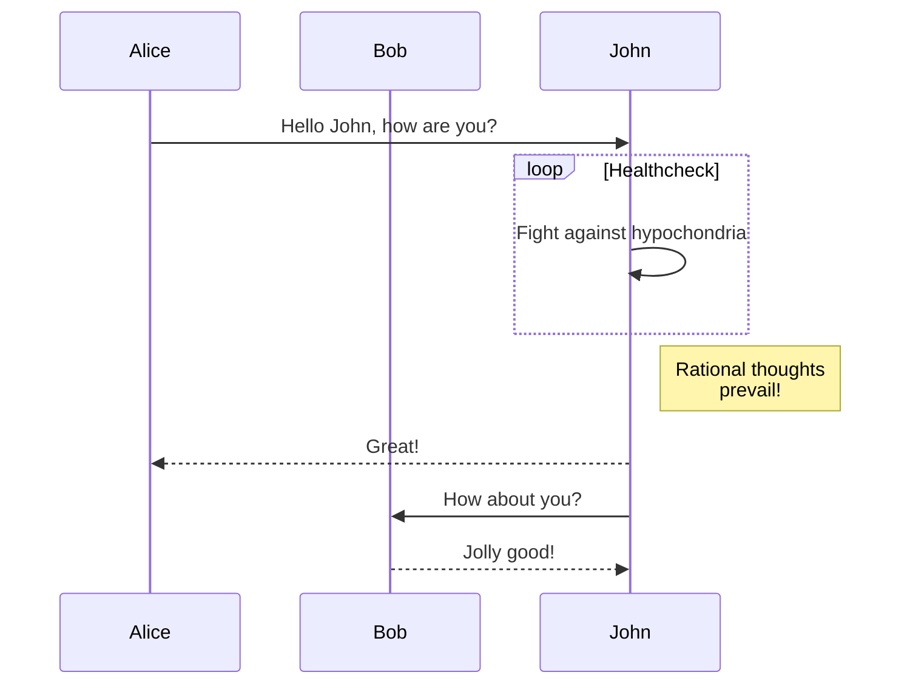
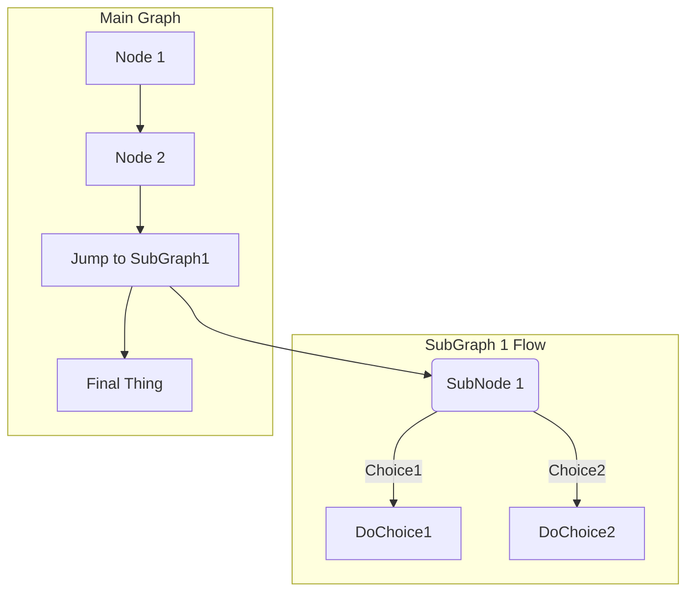

# Mermaid experiments: Generating diagram/flowchart from text

Repository: https://github.com/mermaid-js/mermaid

Manual: https://mermaidjs.github.io/#/

CLI repository: https://github.com/mermaid-js/mermaid-cli

## Gitlab

Gitlab [support native mermaid integration](file:///home/irving/Downloads/Legal_springer_books_covid19/Looks interesting/2019_Book_IntroductionToLogicCircuitsVHDL.pdf)
so the following charts should be rendered natively if you open it in the original Gitlab repository.

## Mermaid-CLI

You probably dont want to commit everytime you want to check if the diagram syntax is correct.
The CLI can be used to convert a text file containing a chart to outputs like svg, png and the like.

Note the CLI only expects one chart data with no extraneous data
so you cannot feed this markdown file into the CLI and expect it to work
nor can you make a file containing multiple charts.
